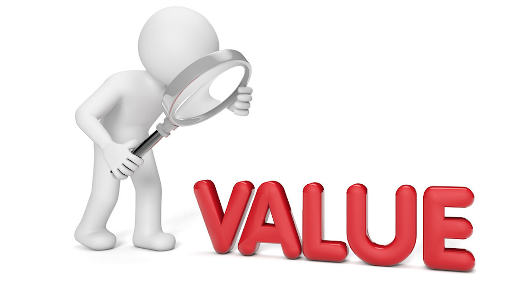

前一段时间在做U内的价值交付。
个人也从最开始的可意会不可言传的状态，到后来可以聊些概念和措施的阶段。

老实说，曾经在我司经常听到Dev challenge BA：“你这个需求的价值是什么？”现在反而听到越来越少。
曾经我们坚持要去做有价值的事情，直到我们现在不得不 highlight 出 `价值交付` 这个标题。
并且常常会被问到 —— 价值交付，它到底指什么？
<!-- more -->

## “价值交付是什么？”
首先，我不会尝试直接回答这个问题。
作为一个交付型U，我们先从一些耳熟能详的理论和方法实践中，尝试找到“价值”这个词。

1. 敏捷软件开发宣言
>我们一直在实践中探寻更好的软件开发方法，身体力行的同时也帮助他人。
>由此我们建立了如下价值观：
>
>个体和互动 高于 流程和工具
工作的软件 高于 详尽的文档
客户合作 高于 合同谈判
响应变化 高于 遵循计划
>
>也就是说，尽管右项有其价值，
我们更重视左项的价值。

2. 相互依赖声明（敏捷项目管理宣言）
> 敏捷和自适应的方法把人、项目和价值联系起来
> 我们是一群能够非常成功地交付成果的项目领导者所组成的团体。为了能成功交付：
> 
> 我们通过关注持续的价值流，以此来提高投资回报率。
> 我们通过与客户的频繁交互和分享所有权，以此来交付可靠的结果。
> 我们预先考虑不确定性的因素，并通过迭代、预防和适应的方式管理它。
> 我们承认个人是价值的最终源泉，努力建立一个人尽其才的环境，以此释放创造力和创新力。
> 我们通过团队结果问责制以及团队责任分享制，以此来提升绩效。
> 我们按照具体情况制定策略、过程和实践，以此来提高效率和可靠性。 

3. 精益
好吧。无论是精益软件开发7原则，还是丰田精益方法的14原则都没有提到“价值”这两个字。
但是，在《精益思想》进行了这样的总结 —— 5个原则：
> 精确地定义特性产品的价值；
> 识别出每种产品的价值流；
> 使价值不间断地流动；
> 让客户从生产者方面拉动价值；
> 永远追求尽善尽美。

从前两组概念 —— 敏捷和敏捷项目管理，来直接追溯价值交付，看起来总是有些刻意。
而精益思想的第一原则“精确地定义特性产品的价值”，直接从用户受众的角度入手，就看起来直观的多，因此我这里就直接从精益来看价值交付是什么。

### 价值交付的具象产出部分 —— 产品
说到精益，如果用一句话来描述它是用来干什么的话，那应该是：`杜绝浪费，降本增效。`
当然，如果提到它诞生的背景的话，它解决了工业化大生产中的提前批量性生产、生产时间周期过长、生产可预测性不准等问题，但解决问题的终极思路就是：`在保证价值的同时，持续不断、稳定地消除浪费，从而降低成本提升效能。`

说到“浪费”：丰田模式中，将生产活动中的各环节分为3类步骤：
* 明确能创造价值的步骤
* 虽然不能创造价值，但是在现有技术和生产条件下不可避免的步骤（**1型浪费**）
* 不创造价值，并且可以去掉的步骤（**2型浪费**）
针对产品制造的第一要务就是首先定义价值，从而识别整个生产活动中能够创造价值的步骤、1型浪费和2型浪费。然后消除2型浪费，并将1型浪费逐渐转化成2型浪费从来最终消除。

#### 首先定义价值

同样的道理，在软件交付中，首先的出发点就是价值，并不是一堆一堆的功能集、features 或者 看起来非常 fashion 但不解决自身问题的前沿方案。

然而无论是制造业还是软件业，价值只能由产品的使用者 —— 最终用户来确定。
一般在交付团队中，会有两种情况：
* 客户就是用户 
* 客户只是尝试设计产品，用户是另外的群体。
在客户不是用户的情况下，如果客户并没有收集和分析用户的真实需求，整个交付过程就会变成 —— 提前生产、没有以需求来拉动生产，最终价值交付物是否能产生价值只能凭玄学的地步。一旦不能产生价值，就变成了最大的浪费。

交付价值，只有在用 —— `具有特定价格、能在特定时间内满足用户需求的特定产品`（无论商品或者服务）来表达时才有意义。
所以，在交付之前，先确定产品的价值 —— 开发的人力成本、时间成本、机会成本，和最重要的一点 —— 这是否解决了用户的真实问题吗？以及是否“更好地”解决了用户的真实问题？
为什么这里有“更好地”一说？
就比如同样是员工打卡系统，在开发各成本投入产出比相似的情况下，上AI人脸识别 —— 自然是比手工签到的价值要大的。

也许有人会说，“我们使用敏捷，就是因为当下无法定义出明确产生价值的需求，才使用敏捷软件交付 —— 实现增量性发布、快速实验和反馈。”
这里要分两种情况来看这个问题：
* 第一种情况：只是短视的一种借口。懒于、或者能力不足直接放弃努力，造成无法通过问题收集、需求分析和商业洞见对各种业务方案进行过滤，从源头上就开始产生软件开发的大量浪费。
* 第二种情况：已经有了需求收集和分析渠道，但行业方案较新，无法完全避免产品实验开发的浪费。这种，在更下游、更靠近用户的地方，是否建立了有效的用户反馈、价值追踪和核定机制 —— 实验的效果是什么样的，生成了哪些价值，是否帮助我们更好地逐渐形成价值定义？

实现完价值定义之后，我们针对当前价值定义来看看“交付”这个动作。
#### 从需求到产品的快速研发能力

##### “识别出每种产品的价值流”
用过 Scrum 或者 Kanban board 的人应该都理解，一张卡（无论 EPIC 卡还是 story 卡），其承载的就是一个价值点（这里不涉及到估算）。

而将 board 上的各个 columns 对应的步骤连接起来，其实就组成了完成此类卡的一条粗粒度的“价值流”。其中，有产生价值的In Dev、In QA等，也有1型浪费Dev Done / Ready for QA 等等，当然个别团队可能还存在2型浪费的 columns。
价值流的目标就是让团队识别出流程步骤，为之后消除这些浪费做准备，最终降低开发成本、缩短lead time。
那从这种粗粒度的”价值流“中如何逐渐暴露浪费和执行改进呢？

##### “使价值不间断地流动”

也许有人会觉得这句话理解起来很难，其实在部分团队内非常常见。
比如：见过一些客户团队，所有 story 的开发只要开发人员开发完毕，就推进Dev Done column 中，等到整体功能开发的差不多了，才引入 QA 来开始测试，在此之前 QA 资源可能在忙于另一个团队的测试工作。一种类似制造业批量化生产的模式，生产步骤之间存在大量库存，批量满额之后，才会推进到下一个生产环节。
也有一些敏捷团队，由于 QA 资源不足，出现相同的Dev Done之后在Ready for QA中形成批量等待，始终无人解决，甚至大家对此已经习以为常 —— QA会在下一个sprint整体测试这批卡。
“使价值不间断地流动”，其实不仅是行动、更是从思想和意识上认识到 —— 价值要流动起来。就像最后那些敏捷团队的例子，即使使用了敏捷流程和工具，思想和意识不到位，依然用出了批量的样子。

有人会说：“这种批量有什么不好？团队上所有的人都在工作，并没有空转，人力没有被浪费。“
如果一定要从项目人力运营的知识域中来看价值交付，我只想说：是的，大家看起来都忙忙碌碌，行色匆匆，努力“做事”，但是人力花完就代表创造了价值么？
另一方面，我也可以从”测试前置“、”一次性把事情做好“、”缺陷越晚修复，修复的成本越高“、”开发周期越长，越容易返工“等等方面来聊一聊不关注价值流会造成的种种人力成本、时间成本、机会成本上的浪费。

只有让价值尽量不间断地流动起来，从需求到生产，才会暴露问题 —— 让团队观察和思考这种端到端的整条价值生产活动中，哪些是产生价值的，哪些是浪费？持续地逐渐优化和消除浪费后，降低开发成本、提升研发效能。

##### “让客户从生产者方面拉动价值”
当研发效能提升、单个价值点能被快速完成端到端交付时，提前预测性质的功能设计（是否能最终产生价值靠玄学的那种）就可以完全被避免，由最下游的终端用户直接提出需求，从来拉动交付。

#### 方案、技术先进性的加持
在前面我讲board上面的价值流的时候，始终特指其是”粗粒度“的价值流。
为何？
因为无法从这些columns中看到：用A框架开发会比B节省多少开发成本、使用某个自动化测试方案可以节省多少测试成本，诸如此类的“细粒度”的价值流才会发现的浪费对比。
这种时候，各团队面临的问题各不相同，需要团队一线人员自身的方案和技术能力去扩展优势、消除浪费，不再局限于敏捷软件开发流程、scrum / kanban board来宏观指导和描述开发流程。

这里就涉及到精益思想的最后一个原则：*“永远追求尽善尽美”*。

### 价值交付的土壤 —— 团队能力 / 学习型组织
精益思想前四大原则都只是在讲 —— 如何消除产品生产过程的浪费，最终形成高效有价值的生产流程。一般完成前四原则，基本可以收获 `突破性改善`（指初次改革，调整生产活动后，一次性获取到的改善效果）。
精益思想用最后一个原则`“永远追求尽善尽美”`，才提到了如何 `持续性改善` 。

而《丰田模式》用了一整本书，来讲如何实现“追求尽善尽美”、实现“持续性改善” —— 即使完成了前面四个原则，或用了大量的精益工具和实践，只要没达到一点，就不是精益。精益 —— `打造一个真正的学习型组织。`

这个“学习型组织”，不是说 —— 只是在组织内培养学习氛围，今天去学几种对价值流毫无帮助的语言或架构，明天去做一些对当前主业务毫无扩展的社区活动。也不是说，当某个团队需要一个大数据工程师时，需要从零开始培养，当第二个团队又需要一个大数据工程师时，再次另外培养。
而是说 —— 培养学习氛围、过程中不断创建“标准化”以达到“稳定”，然后让成员发挥创造性思维和创新能力以持续改进价值流的组织。

为什么说“团队能力/学习型组织”是价值交付的土壤呢？
假设某团队前四原则背后的工作并不是团队自发形成完成的，是由一个外部人员引入并督促实践完成，本团队并没有掌握其能力。当用户需求拉动生产越来越快时，必然会暴露进一步需要解决的瓶颈和浪费，这时候团队离开了外部人员根本无力继续持续改进从而稳定交付价值。

为了真正实现精益的持久性改善和价值交付，这需要一个自下而上的过程。
仅靠上级制定几个衡量指标，没有培养团队的学习和自组织能力，你永远也想像不到真正实践时会长成什么样子。
将团队的指标呈现想像成地上的树，如下图。
上级也许期望是扎根价值交付、持续性改进指标背后的问题。但团队也许只是做了一些流于表面的工作让指标变得好看。

## 最后
何为价值交付？
以打造学习型组织或团队为基石 —— 精确定义产品用户价值，尽可能以追求价值卓越为目标，从需求提出开始到产品上线被终端使用，持续消除或者减少阻碍产品研发的浪费，最终实现产品价值。

看起来，精益贯穿始终。
再回来看看《敏捷宣言》和《相互依赖声明》，发现和精益很多方面都很相似。只不过在我看来，精益可以更好的端到端描述整个价值流思路。