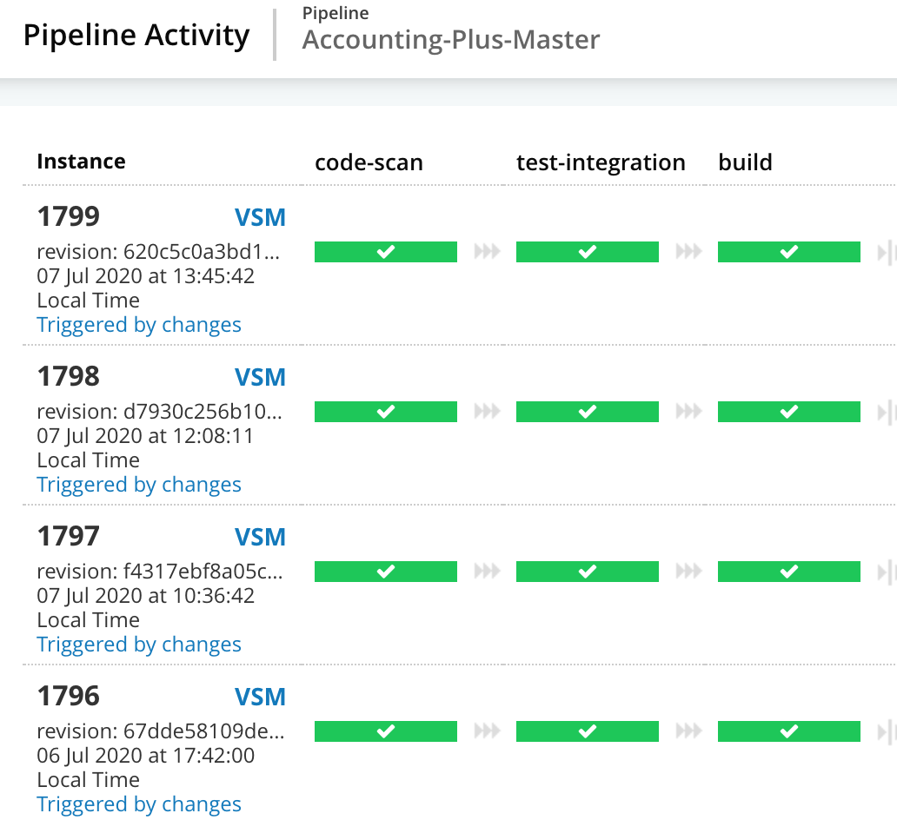
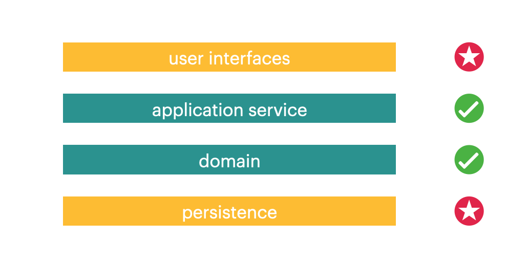
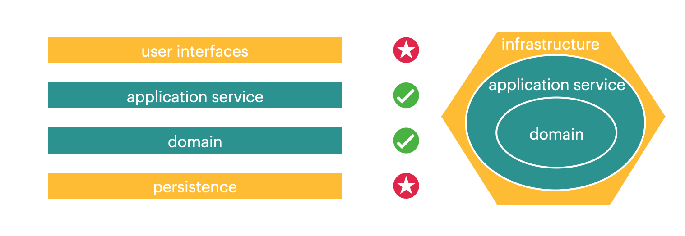
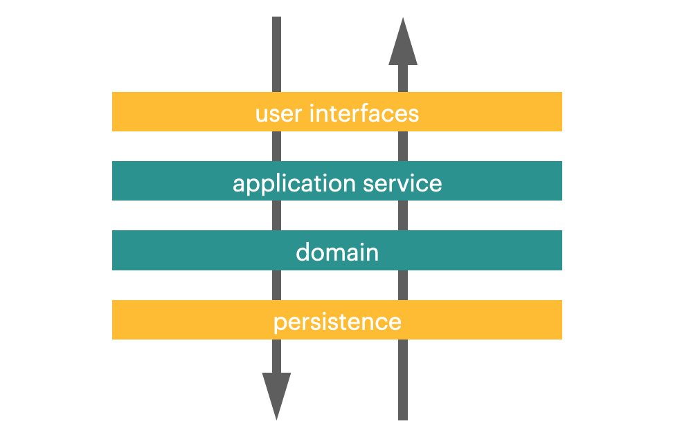
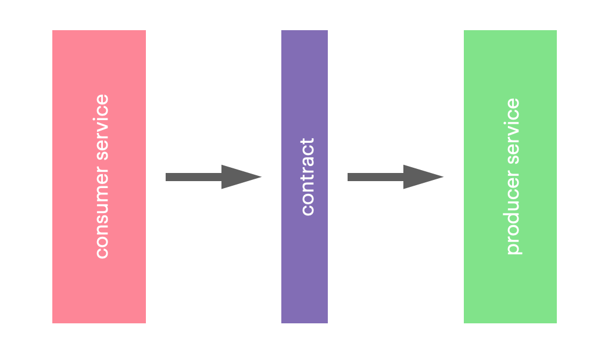
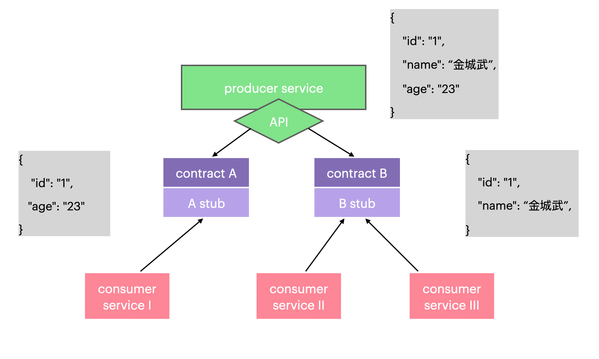

研发效能不等于研发效率。

在我司的`研发平台解决方案`的定义中，研发效能 = 可持续快速交付价值的能力 = 效率 + 质量 + 用户价值。

如果不能达到相应的质量标准和用户价值，再高的研发效率也是枉然。

这里我专门聊一下效率和质量之间的结合一个点。

### 在对质量的追求中，如何优化研发效率？

<!-- more -->

在敏捷团队里，开发人员往往被要求编写单元测试、集成测试、契约测试等等自动化测试，并且在 CI 流水线上创建对应的`test stage`，通过每次提交代码后重复运行 —— 来获取测试情况，以此来增添交付质量的保证。




CI 流水线上运行的自动化测试，大家一定不陌生 —— 一次编写、重复运行、变更时及时维护。

对团队而言，__可视化__、最直观的就是，测试的运行效率、运行时长。

因此，团队会尽量缩短测试集的运行时长，以达到快速反馈和提高流水线的及时使用率。

同时，快速的测试运行效率，也可以缩短开发人员进行代码预提交的检查时间。


在一般__不可视化__的角落，其实还有日常的测试编写和维护的效率。

当团队要求较高的代码覆盖率时，往往一个 story 的开发时间中，可能有一半左右用以编写上述自动化测试。

所以，在研发效能度量中，自动化测试的效率包括两个部分：


不仅要优化测试集的运行效率，同时还要优化测试编写的效率。


### 测试金字塔是个合适的策略

[测试金字塔](https://martinfowler.com/bliki/TestPyramid.html)主导思想就是，通过不同的测试类型组合，来达到质量与投入产出比的一个平衡取舍 —— 以合适的投入产出比，来获取一个较高的质量。

除开硬件资源的投入（如 CI 资源），投入产出比与研发效率是线性的关系。


测试金字塔中，底层的单元测试拥有反馈快、代价低、单一职责的特点，因此作为基数最大的基层测试 —— 用以覆盖绝大部分代码逻辑。

基于单元测试上的其他上层测试，主要以其他角度弥补单元测试的不足，如组件完整性等等，同时它们面临的问题越来越复杂、范围越来越广，启动和运行的过程也会越来越重，编写和维护成本也越高。

因此，运用测试金字塔，利用大量的底层单元测试来尽量覆盖代码逻辑，是同时优化`测试编写效率`和`测试集运行效率`的一把有利钥匙。


### 单元测试覆盖所有代码逻辑 —— 不可能做到？

以服务架构举例，从传统的分层架构说起。（代码术语以Java/Spring为背景。）


从技术实现角度来讲，只有其中的 application 层和 domain 层可以实现真正意义的单元测试 —— 只测试单元本身，仅使用 Junit + mokito，测试反馈总时长在秒级以内。  

从代码实现来看，user interfaces 和 persistence 其实也可以仅使用 Junit + mokito 来编写单元测试。  
但问题是：这两层只使用单元测试来测方法体本身，没有意义。  

#### 1. 是否要单独测试 user interfaces 和 persist 层？

这里有块示例代码，见下。  
user interfaces 里面定义的基于 Spring MVC 的 controller，看起来方法体内只有一两行代码，同时下层 applicationService 和 mapper 逻辑已经由自身单元测试覆盖了。  

```
    @GetMapping("/customers/{customerId}/projects/{projectId}")
    @PreAuthorize("hasRole('USER')")
    @ResponseStatus(HttpStatus.OK)
    Set<LatestPipelineInfoResponse> fetchLatestUploadInfo(@PathVariable @Min(0) Long customerId, @PathVariable Long projectId){
        Set<LatestPipelineInfoDTO> dtos = this.service.fetchLatestUploadInfo(customerId, projectId);
        return LatestPipelineInfoResponseMapper.MAPPER.fromDto(dtos);
    }
```
如果使用单元测试，仅仅测的是 controller 对 service 和 mapper 的成功调用，意义很小。

我们这看一下上面这个controller method背后覆盖了多少逻辑：  
* 监听http request

* 将http request中的数据反序列化转换成Java objects, 注入到方法调用的入参中

* 验证入参

* 验证 security 权限

* 调用业务逻辑

* 将业务逻辑返回的Java objects序列化返回到response中

* 处理以上环节中发生的异常  

  

  一共7项，虽然代码实现起来很简单，这是因为 Spring 框架帮开发人员简化了很多代码量。  
  单独测试user interfaces层，并不是说要测 Spring 提供的框架能力，而是要测这块定制代码最终实现的是 —— “正如你所愿”。  

  

相同道理，在persist层，如果代码里有复杂的逻辑，比如动态查询，或者直接HSQL、SQL。如：  
```
public interface PipelineHistoryJpaRepository extends
        JpaRepository<PipelineHistory, String> {

    @Query(nativeQuery = true, value = "SELECT * FROM pipeline_histories p, " +
            "(SELECT max(id) AS id FROM pipeline_histories " +
            "GROUP BY customer_id, project_id, pipeline_name) tmp " +
            "WHERE p.id = tmp.id " +
            "ORDER BY customer_id, project_id, pipeline_name")
    public List<PipelineHistory> fetchAllExistsPipeline();
}
```
persist层逻辑，也需要使用测试覆盖。  
当然，如果是JPA自动生成的findBy、save等等系列，不在这块范围之内。  

#### 2. 如何单独测 user interfaces 和 persist 层？

user interfaces 和 persist 层因为框架和工具的原因，只能带上Spring application context一起启动测试。  
正常来说，它们已经算是集成测试了，集成了 Spring 容器。   

用过 @SpringBootTest 的人，一定对其造成的测试编写效率和运行效率印象深刻 —— 可能只是添加了几个 Bean，就会让 context 的启动时间延长几秒，不恰当地使用某些test annotation也会造成context的重新加载和刷新。   

本人也用过很长一段时间 —— 通过 API 调用整个组件（`controller `-> `servcie`->`repository`->`memory db`）, 以实现对user interfaces 和 persist 层的覆盖。即使在成功优化Spring加载机制 —— 每次批量运行测试用例仅加载一次 application context，但每次编写新的API测试、修复API测试仍然痛苦不已 —— 每次运行单条测试进行反馈时，依然要等待一次完整的 context 启动。    

因此，这里推荐使用Spring提供的切片测试工具（Tests Slices）: @WebMvcTest、@DataJpaTest。其原理是仅创建简化的application context，少量的bean，使用轻量级、有针对性范围的方式，降低反馈时间、提升测试性能。  
在编写测试、运行测试的性能上，切片测试的反馈效率的确赶不上单元测试，但对比 @SpringBootTest 加载几乎完整 context 的情况已经优化不少。    

#### 3. 最终的目的：利用基层的测试来整体覆盖代码逻辑

回到之前的问题：技术意义上的单元测试的确不能覆盖所有代码逻辑。

但，`单元测试` + `轻量级的、快速反馈的 slice tests` 可以尽量覆盖到所有代码逻辑。

因为`单元测试 + slice tests`的目标是为了完成分层架构内的逻辑测试，为了避免语义上的冲突，因此这里将两者一起称为`层级测试`。  
除了传统的分层架构，也来看看六边形架构、或者叫接口适配器架构是不是适合进行`分层测试`呢？  
其实不然，六边形架构在宏观意义上，其实可以看成是“两层” —— domain 和 infrastructure。  

正好对照了 unit tests 和 slice tests 的分界。  
而这两层的区别，在于 unit tests 测试的是系统中稳定的业务层，可以尽量多的追求代码覆盖率；而slice tests 测试的是对基础设施的依赖适配和定制逻辑，追求定制逻辑的功能覆盖。  
最终同样得以完成对 ”代码逻辑“ 的整体测试覆盖。  

### 题外：

#### 1. API集成测试（API Integration Tests）


在完成前面的层级测试、覆盖了所有逻辑细节之后，就轮到跨层级的连通性测试了。  
这里虽然命名为“API集成测试”，其实也叫“组件测试”。由于系统架构由来已久，到微服务架构的时候，一个组件的边界已经是一个微服务的边界，针对微服务的API特性, 这篇文章里称其为“API集成测试”。    

基于测试运行的可重复性，API集成测试中需要降低对外界的依赖，比如微服务在真实环境中对数据库、外部服务的依赖。   

数据库可以替换成能力相同的内存式、或嵌入式数据库，比如生产mysql\mariaDB 可替换成 mariadb4j 实现嵌入式数据库；外部服务依赖，使用服务边界mock进行统一管理。    

借用**[Toby Clemson](http://github.com/tobyclemson)** 的一张微服务组件测试的图，橙色的虚线正是组件测试的边界。[原图来源](https://martinfowler.com/articles/microservice-testing/)    


使用 API 集成测试实现组件内部的连通性测试，一般测试路径选择覆盖层级完整的 happy path，不要企图去测试各逻辑分支。  

举个例子：  

一般写API集成测试的时候，常会遇到层级间“传递参数缺少校验“的问题，如 controller 调用 applicationService 时，入参传递了一个未预料的`null` 值，这个`null`值的校验，应该由具体代码 controller 与 applicationService 之间进行约定：可以是接收方编写防御性校验，也可以由调用方前瞻性校验。  

因此，此处`null`值校验的逻辑完全是可以在 Layer tests中由测试覆盖。不要试图在API集成测试中覆盖这个`null`和`非null`分支。  

#### 2 契约测试(Contract Tests)

之前测完各层级逻辑、组件内的调用连通性，接着来看一下微服务边界的契约测试。  



##### 契约 vs API

对于契约测试，首先要避免进入 —— 一条API就应该是一个契约的误区。  

记住，契约测试有个“首要精神“：`消费者驱动契约（Consumer Driven Contracts）`。  

举个例子：  



服务producer，本身实现了一条API，返回资源 —— 每个会员的详细信息，包括：`id`、`age`、`name`。  

服务consumer I、II、III知道 producer 服务可以提供会员信息资源，于是分别来与producer谈需求、谈集成，最终形成两份需求约定，见上图。  

差别是：一份约定必须返回`id`和`age`字段，另一份约定必须返回`id`和`name`字段。  

这也就形成了两份契约 —— 是根据消费者的需求直接驱动的。  

从 consumer 角度来看，根本不关心 producer 的API是否是复用，这里只是恰好多个契约可以共用一条API而已，因此每个consumer的基本诉求就是 —— 无论之后API的实现如何变动，都不能影响自己契约内的数据。  

接着在需求发布以后，consumer III的需求需要变动 —— 将返回的`name`字段，分切成`firstName`和`lastName`，这时候就形成了第三份`契约C`。无论具体API如何变更，都有两个基本的安全校验阀在那里：`契约A`和`契约B`。  

也许有人会说不需要`契约C`，为了省事儿consumer III拿上`name`字段自己拆嘛。这种思路在现实谈需求、谈集成中其实经常会碰到。 这里一个小的玩笑：请告诉我，你觉得”金城武“是姓”金城“，还是姓”金“？  

##### 契约测试需要双方维护

`契约（contract）`以满足consumer需求为目的，以consumer定义为主导，但 producer / customer 双方都有校验契约交付物的权利和义务 。  

`契约测试`，首先运行在producer的`auto test`中，以保证任何时候 producer 代码变更之后都满足契约。  

同时该契约需要生成stub，提供给 consumer 以作为test double，consumer 依赖此契约的场景使用测试覆盖，以保证契约被变更时 consumer 能够及时获知。  


##### 不要滥用契约测试

契约中主要约定是三部分：`调用方式`、`数据类型`、`数据格式`。因此契约测试主要校验的是这三部分，不包括数据值。  

并且每一份契约的形成和变更，都会涉及到两方团队的沟通、协议和实现，比单元测试、API 集成测试 —— 代价高，效率低。  

因此，契约测试在测试金字塔中位于 API 集成测试上方。  

除了`调用方式`、`数据类型`、`数据格式`外，需要使用单元测试、API 集成测试的方式覆盖。  


#### 3. E2E测试

在软件研发阶段的 E2E 测试，一直有`无法稳定重复运行`、`代价高`、`效率低`等等问题，因此一直被放在测试金字塔的顶端。  

在微服务架构、多微服务环境部署中，在 E2E 是基于环境、运行时的情况下，这些问题就更加突出。  

因此，E2E 测试的目标和范围在团队中需要仔细的被定义。  

在本文的上下文——研发阶段的质量内建，推荐仅将 E2E 测试作为基于几个关键业务场景的服务连通性测试。  


当然，如果团队有一票专门来写E2E测试的人手，愿意承担高代价的成本、觉得这种ROI可以接受，也是可以多写写E2E测试的。  

